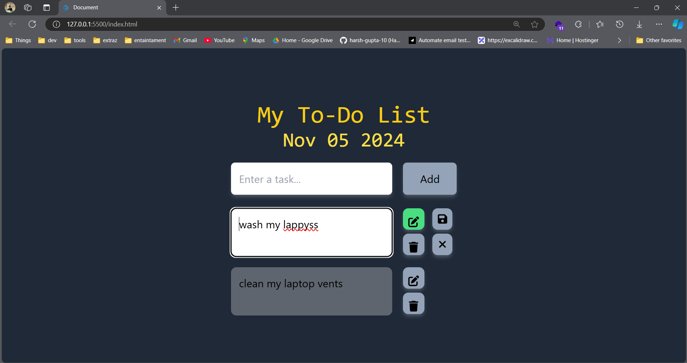

# To-Do App

A simple and interactive To-Do list application built with **HTML**, **Tailwind CSS**, and **JavaScript**. This app allows users to add, mark as completed, delete tasks, and stores tasks in **localStorage** to persist data even after refreshing the page.



Try it yourself by clicking [here](https://js-todo-local-tailwind.vercel.app/).


## Features

- Add new tasks.
- Mark tasks as completed.
- Delete tasks.
- Tasks are saved in the browser's **localStorage**, ensuring they persist even after page reload.
- Responsive design for both desktop and mobile views.

## Technologies Used

- **HTML** – Markup for the structure of the application.
- **Tailwind CSS** – Utility-first CSS framework for responsive design and styling.
- **JavaScript** – Logic to handle adding, deleting, and toggling tasks, as well as storing and retrieving tasks from **localStorage**.

## Installation

1. Clone the repository:

   ```bash
   git clone https://github.com/harsh-gupta-10/JS-todo-local-tailwind.git

2. Navigate to the project directory:

   ```bash
   cd JS-todo-local-tailwind

3. Open index.html in your browser to see the app in action.

  Alternatively, you can open the index.html file using your preferred code editor and live server extension (e.g., Live Server in VS Code) to see it dynamically.

  Or Visit [here](https://js-todo-local-tailwind.vercel.app/).

## How It Works (LocalStorage)

- The app uses **localStorage** to persist tasks across page reloads.
- When you add a new task, it is saved to localStorage.
- When you mark a task as completed, the change is saved to localStorage.
- Deleting a task also updates localStorage to reflect the change.
- Tasks are retrieved from localStorage and displayed when the page is loaded, ensuring the list remains intact after refreshing.

## Usage

1. **Add a task**: Type the task name into the input field and press **Enter** or click the **Add Task** button.
2. **Complete a task**: Click on a task to mark it as completed. The task will change style (e.g., text will be crossed out).
3. **Delete a task**: Click the **Delete** button next to the task to remove it from the list.
4. The tasks you add, delete, or mark as completed will be stored in **localStorage**, so when you reload the page, your tasks will still be there!

## Contributing

Feel free to fork this repository and submit issues or pull requests. Contributions are welcome!

## License

 This project is licensed under the MIT License.<!-- – see the [LICENSE](LICENSE) file for details. -->

## Acknowledgments

- **Tailwind CSS** for making beautiful, responsive design easier.
- **JavaScript** for handling app interactivity and localStorage functionality.
